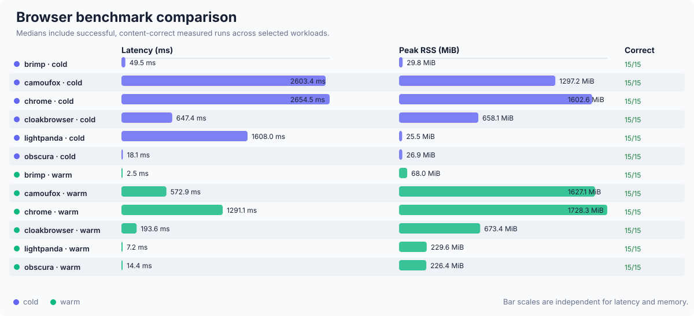

# Brimp

Brimp is a lightweight, headless browser for agents. It combines JavaScriptCore with
Blitz's DOM implementation and curl-impersonate as the network stack.

If you are familiar with `requests` or `curl_cffi`, you can treat Brimp as the
same simple request/response workflow with a JavaScript-rendered HTML result.
Brimp offers Python and Node.js bindings.


## Why

Getting the html with `curl_cffi` is easy, but oftentimes, you need to render the page
with JavaScript, and anti-bot services are consistently probing if you have a valid
browser environment, hence JavaScript fingerprints.

Brimp, short for browser-impersonate, tries to add the missing JS and DOM layer for
curl_cffi.

## Features

- Page rendered with DOM and JS, so you don't get the empty html placeholder.
- `curl-impersonate` as the network stack, providing perfect Ja3/TLS, http 2&3 fingerprints.
- The familiar `curl_cffi` API and experience from the same maintainer.
- Also supports CDP, drop-in replacement for heavy headless browsers.
- Much faster than playwright with Chromium, on par with popular alternatives.
- Python and Nodejs bindings.
- Pre-compiled, so you don't have to compile on your machine.
- MIT licensed.

||chromium|camoufox|cloakbrowser|lightpanda|obscura|brimp|
|---|---|---|---|---|---|---|
|JS & DOM|✅|✅|✅|✅|✅|✅|
|http/3|✅|✅|✅|❌|❌|✅|
|CDP|✅|✅|✅|☑️<sup>1</sup>|☑️<sup>1</sup>|☑️<sup>1</sup>|
|screenshot|✅|✅|✅|❌|✅|✅|
|requests-like|❌|❌|❌|❌|❌|✅|
|JS engine|V8|SpiderMonkey|V8|V8|V8|JSC|
|open source|✅|✅|❌|☑️<sup>2</sup>️|✅|✅|
|ja3 fingerprints|☑️<sup>3</sup>️|☑️<sup>3</sup>️|☑️<sup>3</sup>️|❌|✅|✅|
|fast?|🐢|🐢|🐢|🐇|🐇|🐇|

<small>
Notes:
<ol>
<li>Only a common subset was implemented.</li>
<li>Lightpanda is under the AGPL license.</li>
<li>Fingerprints are fixed to the browser version</li>
</ol>
</small>

For performance comparisons, see the [benchmark](#benchmark).

## Install

Release packages currently target macOS arm64:

For python:
```sh
pip install brimp
```

For node.js:

```
npm install @brimp/brimp
```

The standalone `brimp` and `brimp-cdp` executables are produced by the source
build below.

## Usage

### CLI

Check the native runtime, evaluate JavaScript after navigation, or capture a
PNG from the command line:

```sh
brimp doctor
brimp eval https://example.com --js 'document.title'
brimp screenshot https://example.com --output example.png --full-page
brimp eval https://example.com --persona persona/example.json --js 'navigator.userAgent'
```

### Python

The Python binding is synchronous and in-process. `Response.text` is the
original HTTP response text; `Response.html` is the live DOM serialized after
page scripts execute.

```python
import brimp

response = brimp.get("https://example.com")
print(response.status_code)
print(response.html)
```

Use a Session to retain cookies and connections and to access the current
rendered document:

```python
import brimp

with brimp.Session() as session:
    response = session.get("https://example.com", params={"q": "browser"})
    response.raise_for_status()
    print(session.evaluate("document.title"))
    session.screenshot("example.png", full_page=True)
```

### Node.js

```js
const brimp = require('@brimp/brimp')

async function main() {
  const browser = await brimp.launch()
  const page = await browser.newPage()
  await page.goto('https://example.com')
  console.log(await page.evaluate('document.title'))
  await page.close()
  await browser.close()
}

main().catch(error => {
  console.error(error)
  process.exitCode = 1
})
```

### With CDP clients

Start the bounded loopback CDP server and connect with `puppeteer-core`:

```sh
brimp-cdp --bind 127.0.0.1:9222
```

```js
const puppeteer = require('puppeteer-core')

const browser = await puppeteer.connect({
  browserURL: 'http://127.0.0.1:9222',
})
const [page] = await browser.pages()
await page.goto('https://example.com')
console.log(await page.evaluate(() => document.title))
await browser.disconnect()
```

Brimp implements the CDP subset needed by this workflow, not the complete
Chrome DevTools Protocol.

## Building from source

As in the current stage, we only support building on local macOS environment.

### Prerequisites

The current JSC binding targets macOS and dynamically links a JSCOnly build at:

```text
../WebKit/WebKitBuild/Release/JavaScriptCore.framework
```

Set `BRIMP_JSC_FRAMEWORK_DIR` to use a different framework directory. The
Brimp-owned network transport links `libcurl-impersonate` from `/usr/local/lib`;
set `BRIMP_CURL_LIB_DIR` to use another location.

## Benchmark

Here is the latest complete fixture benchmark for Brimp and the other agentic
browsers. Each result validates the live DOM; incorrect samples are excluded
from latency and memory aggregates. Cold results launch a fresh process, while
warm results reuse a browser and create a fresh page.



To run the benchmark:

```sh
cargo run -p brimp-benchmark --release -- --samples 20
uv run --project benchmark/performance --no-sync python benchmark/performance/bench.py
uv run --project benchmark/performance --no-sync python benchmark/memory/memory.py
cargo run -p brimp-cdp -- --bind 127.0.0.1:9222
```

## Development

### Architecture

Brimp is inspired by Cloudflare's [kitesurf](https://blog.cloudflare.com/kitesurf/).

The implemented runtime supports:

- static HTML, JavaScript DOM mutation, style/layout queries, and CPU PNG screenshots;
- HTTP(S) navigation through a transport-neutral `ResourceLoader`;
- linked CSS, common raster images, classic inline/external scripts, `defer`, and `async`;
- parser pausing around blocking scripts;
- events, timers, microtasks, Promise-based `fetch`, cookies, `Location`, and `Navigator`.

The canonical owner-thread automation API is exposed through:

- the `brimp` CLI for evaluation and screenshots;
- a synchronous Requests-style Python binding and asynchronous Node binding; and
- a bounded loopback CDP server for the checked Puppeteer workflow.

All four interfaces delegate navigation, JavaScript, lifecycle, and screenshots
to `web-runtime`; none contains a second browser implementation.

### Testing

```sh
cargo test --workspace
cargo clippy --workspace --all-targets -- -D warnings
python3 -m unittest discover -s benchmark/performance -p 'test_*.py' -v
python3 -m unittest discover -s benchmark/memory -p 'test_*.py' -v
./bindings/package-test.sh
./crates/cdp/puppeteer-test.sh
```

Python wheels are built for manylinux 2.28 x86-64/ARM64, macOS 11+ ARM64, and
Windows x86-64, and bundle JavaScriptCore, curl-impersonate, and their required
non-system runtimes. The Node package remains macOS ARM64. Source builds use the
configurable native discovery paths described in `NATIVE.md`; see each
interface's `SUPPORT.md` for its exact tested surface.
